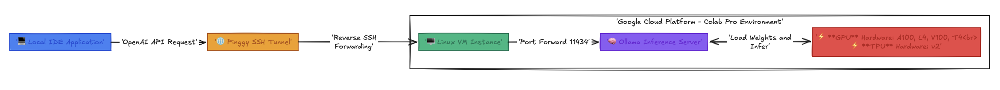

# LLM Colab Tunnel 🚀



This repository provides a seamless way to leverage **Google Colab Pro GPUs** (T4, V100, A100, L4) and **TPUs** as a local LLM backend for your Mac or PC IDE applications. 

By default, Google Colab VMs are not exposed to the public internet. This setup uses **Ollama** combined with a headless **Pinggy SSH Tunnel** to bypass network firewalls, allowing you to establish a secure, OpenAI-compatible API endpoint directly to the Colab GPU.

## Prerequisites
- A Google Colab account (Pro recommended for high-VRAM models).
- Python 3.8+ on your local machine.

## How it Works
1. A Colab notebook downloads `ollama`, bypasses environment restrictions, and pulls the desired model.
2. A Pinggy SSH tunnel exposes the `11434` port on Colab to the public internet securely.
3. Your local IDE application points its OpenAI client `base_url` to the Pinggy URL.

---

## Step-by-Step Guide

### 1. Start the Colab Backend
1. Go to [Google Colab](https://colab.research.google.com/).
2. Click **File > Upload Notebook** and select the `colab_llm_backend.ipynb` file from this repository.
3. Ensure you are using GPU hardware (**Runtime > Change runtime type** > Hardware accelerator: T4, V100, or A100).
4. Run all the cells in the notebook from top to bottom (**Runtime > Run all**).
5. The third cell will download the model (default: `mistral`) and start the tunnel.
6. After roughly 60 seconds, it will print a URL that looks like `https://some-random-string.a.free.pinggy.link`. **Copy this URL**.

### 2. Connect from your Local IDE
Once the Colab notebook is running and has generated your unique URL, you can route any standard OpenAI SDK application to it.

1. Open the included `test_colab_connection.py` script.
2. Find the configuration variable at the top:
   ```python
   COLAB_TUNNEL_URL = "https://your-random-words.a.free.pinggy.link"
   ```
3. Replace the placeholder with the actual URL you copied from Colab.
4. Install the OpenAI SDK if you haven't already:
   ```bash
   pip install openai
   ```
5. Run the test script:
   ```bash
   python test_colab_connection.py
   ```

If successful, it will print **"✅ CONNECTION SUCCESSFUL!"** followed by a response streamed directly from the Google Colab GPU.

## Using with LangChain or DeepAgents
Because this exposes a standard OpenAI-compatible `/v1` endpoint, you can drop this right into your existing projects without altering your framework code:

```python
from openai import OpenAI

client = OpenAI(
    base_url="https://YOUR-PINGGY-URL.a.free.pinggy.link/v1",
    api_key="ollama" # The API key is ignored by the local server
)
```

## Troubleshooting
- **Connection Hanging / Timeout**: Ensure the cell running the Pinggy script in Colab is still active. Colab instances will disconnect if left idle for too long.
- **Model Doesn't Load**: By default, the script pulls the `mistral` model. If you request a different model like `llama3` in your python code without changing the `MODEL_NAME` variable in the Colab script first, it will fail.
